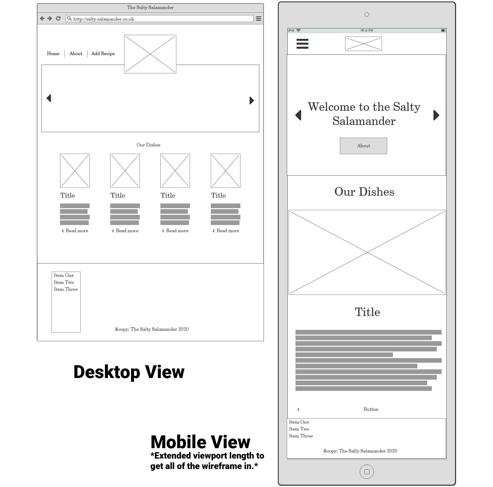
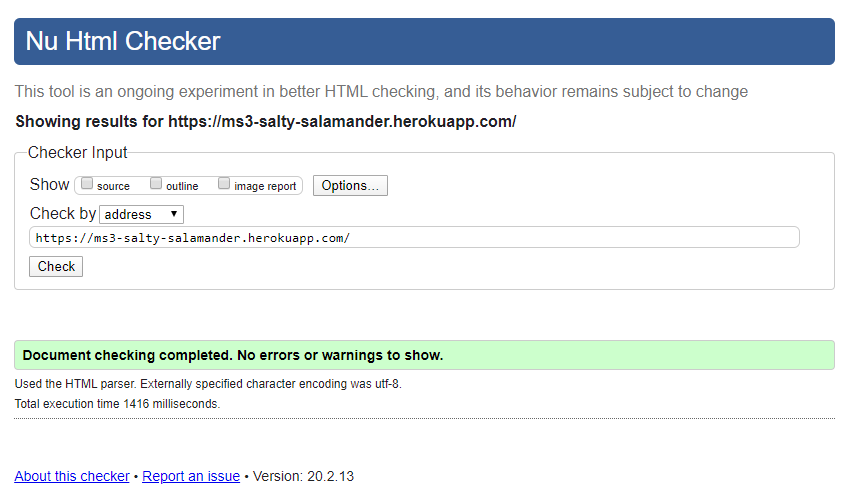
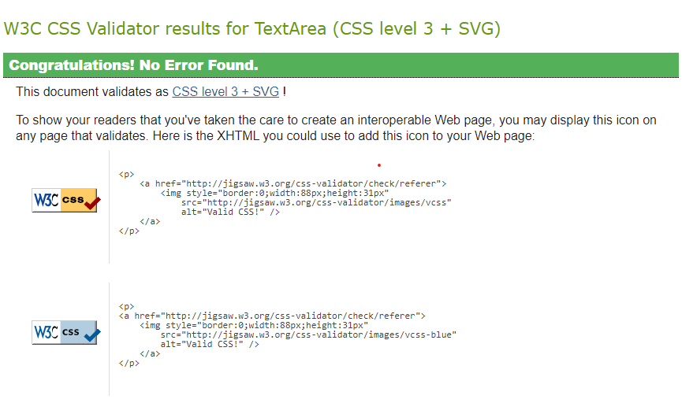
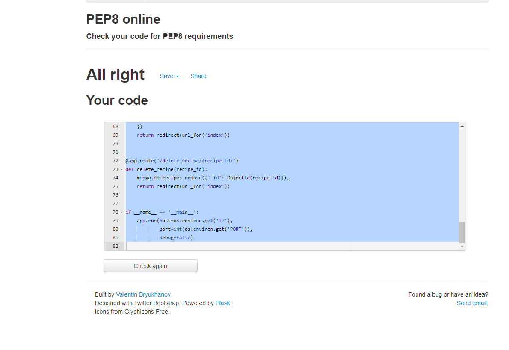

# Milestone 3 Project

## Introduction &amp; Fulfilment

This project marks the milestone between the last three units( Python Fundamentals, Practical Python and Data Centric Development) and hopes to reflect on what I have learnt in these units. I have been tasked with creating a fully responsive CRUD web application. I have chosen the recipe brief and will continue to build an application the can CREATE recipes client side whilst feeding back to the connected database at the backend, READ through the existing recipes stored on the site, UPDATE the recipe records and finally DELETE recipe records that for valuable reason the recipe is no longer needed. It also neccessary to to design this website defensively, so the website is not vulnerable to attacks or vandalism through the front-end to the database. I have named my site "The Salty Salamander" and will allow registered users to login and use the CRUD functionality.

[Live Heroku link here](https://ms3-salty-salamander.herokuapp.com/ "Live Heroku link here" )

### The Salty Salamander

Welcome to The Salty Salamander! Captain Salty here, if you are looking for something tasty to cook up, stray no further! Alas we have recipes aplenty. Have a browse through our wares or create your own, the choice is yours. Think you can make it better? Then prove it, by editing the recipe yourself. Beware to leave your name though, as we don't want recipe piracy!

## User Experience / UX

This project is for my **Data Centric Development** module and my second to last milestone project for my Full Stack Software Development. The main objective for this full stack project is to create a web application that demonstrates the CRUD operations ( Create, Read, Update and delete). The brief I have chosen is to create and build an online cookbook where visitors can use the application as an extension of their paper cookbooks and share, browse, edit and discard recipes in their own cooking community.

### User Stories

Example structure: As a < user >, I would like to < goal > so that < reason >.

* As a user, I would like to **add my own recipes**
* As a user, I would like to **view all recipes easily on one page**
* As a user, I would like to **edit recipes in any of the fields**
* As a user, I would like to **update any recipe I have edited to overright its existing data**
* As a user, I would like to **delete any recipes**
* As a user, I would like to **view a seperate recipe on its own page**
* As a user, I would like to **easily navigate from page to page with ease and no previous knowledge of the site**
* As a user, I would like to **have a point of contact if I have a problem with any of the sites functions**

### Design

I am very passionate when it comes to design and went to long lengths creating a custom logo for this project in a programme called Corel Draw. I use Corel Draw over Illustrator over its better UX for graphics tablets. I used pinterest as my inspiration and spent probably too long looking at different ways to create something unique.
I landed up downloading the CSS stylesheet for Materialize as there were certain styles I wanted to change directly from their stylesheet instead of using overrides, which saved duplicate lines of code undoing the default styles. I found this was a bit time consuming but it made things alot simpler and cleaner when I did need to change a style, as I knew exacty how styles were defined and I didn't have to use important tags.

#### Typography

I have used only two fonts in my project. As I wanted to make it clean, consistent and easy to follow. Google Fonts was my source (as I have always admired how easy it is to reuse their web fonts). Using just two fonts was lighting quick from Google too!
I used 'Sigmar One' as my heading font as I wanted a big bold and in your face font which really stood out. I don't think I could have chosen any better for that! I decided on 'Oswald' as my playful but sharp and clear paragraph font which worked well throughout all different sizes and on multiple elements.

#### Colour Scheme

I have designed the website using orange accents because I feel it draws the user in and has been known colour psychology to enduce a feeling of warmth (like a pizza oven) and excitement (like when I see a salamander!). I used a website caled [Coolors](https://coolors.co/ "Coolors") to then pick contrasting well paired colour matches to the orange.

Just incase you cannot make out the colour references in the picture, I will add them below:

#000000 --> Maintext colour #2D1D00 --> Subtle colour for navigation containers #FF4E00 --> Main accent colour #7B0D1E --> Button colour primary #C61700 --> Icon primary colour and secondary button colour.

#### Icons

I have solely relied on the Materialize icons. Why? I stuck to one set of icons as my theory was to minimize the number of dependencies my application needed, which is good practice if this application ever was to be released to a real life scenario. I found they were a bit more limited than Font Awesome or the Bootstrap Glyphicons but they served their purpose well.
The Materialize icons were very easy to implement and easily customisable.

#### Frameworks

* Flask 1.1.1 - Flask is a "micro web" framework, written in Python. It doesn't require any particular tools or libraries which classifies it as a microframework. I didn't enjoy Flask at first but after I started to get to grips with it, I couldn't help but admire how simple and flexible it is to us.

* Materialize 1.0.0 - Materialize is created and designed by Google using the principles of "Material Design" which according to Google is a combination of the classic principles of successful design along with innovation and technology. I liked the concept that Google is trying to produce, however I didn't feel it was anywhere as flexible as bootstrap and found the number of available components left you wanting a bit more. I did really like some of element animation it showcases built off the back of JQuery.

* JQuery 3.4.1 - JQuery's main purpose is to make it much easier to use Javascript with writing minimal code. Materialize forced my hand on this one, I tend to stay away from JQuery as it can be fairly big and sluggish quite easily if you it enough, which seems odd seeing as its purpose it do the exact opposite. Strange huh? However some Materialize components relied on JQuery library to work properly. So when writing javascript for this project I leaned into using JQuery, to keep my script in one place.

### Wireframing

I drew my initial wireframes just using a pen and some paper before looking further into the context and the navigation I needed to complete the projects. For my more in-depth look into what elements needed what space I startd using a programme called Balsamiq. Balsamiq was quite good at providing a lot of simple elements but it was a bit frustrating for someone with a design background as it was unclear what and what you couldn't ungroup and break apart. The customisation was a bit naff at times, but for simply understanding the space elements were going to need, it was very good and quick to get sorted.

## Technology Used

* **GitPod** - Used as my Sole IDE for writing code.
* **VSCode** - Used as a secondary IDE for linting my markdown text.
* **GitHub** - Used as my primary repository hosting service and version control.
* **Siteground** - I originally used ImgBB to store my images but I didn't get on with it so I used Siteground to independently host my recipe images as I already own a hosting package, so it made sense to utilize its resources.
* **Adobe Photoshop CS5.5** - I used Photoshop to resize and filter my images.
* **Kraken image optimizer** - Kraken is a by far the best FREE photo optimization web application out there, did I mention its free? I used this to crush my photos to an appealing bitesize comparison of what the original files were.
* **Corel Draw X8** - For designing vector files to convert to web assets (i.e. Logo).
* **Coolors** - Used as a colour scheme picker, which I then used as my sole colour palette.

### Front-End Technologies

* **HTML** - Used as the base for project code.
* **CSS** - Used heavily as the base for cascading styles.
* **JQuery** - Used as sole Javascript functionality.
* **Materialize** - Used as base project framework.

### Back-End Technologies

#### Flask

* **Flask** - Used as primary microframework.
* **Click** - Used as the command line interface in Flask.
* **dnspython** - Used as the DNS toolkit for Python
* **Jinja** - Used for templating with Flask.
* **Flask-PyMongo** - Used for storing JSON-like documents.
* **itsdangerous** - Used for cryptographically signing data
* **Werkzeug** - Used as a CGI Library for Flask

#### Heroku

* **Heroku** - Used for hosting my full stack app.

#### Python

* **Python 3.7.6** - Used as Back-End programming language.
* **PyMongo** - Used as Python's API for MongoDB intergration.

#### MongoDB Atlas

* **MongoDB Atlas** - Used to store my database on its cloud servers.

## Features

### Implemented Features

* **Creating a recipe** - As the *create* part of the 'CRUD' operations, I have added the functionality to add a recipe to the database and then view its basic details from the home page (index.html) or all of the data displayed in its own page. The defensive planning I have in place is that all fields are required in order for the form to submit. I have also added a simple REGEX to the image url link, so it will only accept input that start with 'http' or 'https' plus '://'.

* **Viewing a recipe** - As the *Read* part of the 'CRUD' operations, I have added the functionality to browse all the recipes on the homepage or on the recipes own page. From the recipes own page, users can navigate through the additional features of going back to view all the recipes, editing, updating and deleting the recipe they are on.

* **Editing a recipe** - As the *Edit* part of the 'CRUD' operations, I have added the functionality to edit any recipe on the app by navigating to the recipe you want to edit and then clicking the 'Edit Recipe' button from the three sub-nav options.

* **Updating a recipe** - As the *Update* part of the 'CRUD' operations, I have added the functionality to update the recipe which then overrights the existing fields data with the new data which the user has edited or changed using the previous function.

#### Removed Features

Unfortunately due to time and my current knowledge restraints at this point in the course I have choosen to remove the user account features I showed in the navigation areas in my initial wireframe layouts and initial app build. I hope to add them when I have learned sufficient knowledge later in the next module.

#### Future Features

* **Users Area** - I really would have liked to add a user dashboard where the user could register a name and password and have access to their own recipes and assign favourites. However this currently requires knowledge I don't currently possess. I would then limit the CRUD operations to users that have logged in only.

* **Spam and xplicit content filtering** - If this application was going to be deployed to the real world, I would like to add a REGEX filter that would remove any content that contained rude or xplicit context, in order to improve the defensive design of the editing and creating features.

## Testing

**Add Functionality**
I have worked my way through the form's validation by at first not filling out any fields and trying to submit the form. When the form fails to submit it proceeds to point out the Name field has not been filled out. I fill it out and then try to send. It fails. I repeat this process until the whole form is filled out and the form then submits successfully.

**Edit | Update Functionality**
Once navigating to the edit page, I change the first field and press update. I check MongoDB to check the record has been updated. Once I have confirmed it has indeed updated to the database, I also check the index.html page which houses all my recipes and check it has updated on my application. Once I have confirmed that it has I repeat this process for all of the other fields. I am now happy to confirm that all fields update successfully.

**Delete Functionality**
Using the previous *add* functionality, I added a half a douzen test recipes and used the delete button to test the delete functionality. I then backed up the database from MongoDB using the GitPod cli, just as a safety precaution. Once I pressed delete I navigate to index.html page and confirm that it has been removed from the list of recipes. I then visit my MongoDB Atlas database and check the recipe has been removed from the database aswell. Once I confirm that has indeed been deleted I am confident that th functionality is working as it should.

### Validators

**HTML** - *W3 Nu Html Checker* -

I ran the checker initially and it flagged a couple of problems of which I fixed. Two of these errors related to bad practice of img tag attributes. As you can see from the screenshot above, all the problems have now been rectified.

**CSS** - *W3C CSS Validator* -

I ran the checker and it only flagged two errors, in which I used shorthand URLs but I corrected shortly after with Jinja URLs. 

**JS** - *JShint* -
Added the content of my "script.js" file into JShint user interface and it came up with seven undefined variables. However these were due to them being defined in JQuery itself.

**Python** - *PEP8 Online* -
Added Python code to online checker and updated bracket indentation to fall in line with standards.

**Markdown** - *Markdownlint extension* -
I used a VSCode extension to copy and paste my markdown code into, it was very interesting and pushed me to learn more about the best practices.

#### Compatibility

I tested my heroku app URL through a website called [Lambdatest](https://www.lambdatest.com/ "Lambdatest") which used a virtual browser to simulate the web application through each browser. I had good results from, Chrome, Microsoft edge, Firefox and Opera. It was a little slow in Opera and reacted a little patchy when resizing the images in the slider on smaller widths. It didn't work very well on Internet explorer, I'm not sure why. But I have good reason to believe it was something to do with not supporting all the css I had used.

#### Found Bugs and Fixes

**Font Sizes** - I had an initial problem with the resizing of my main font on smaller widths as I was using rem measurements instead of pixels. This had an unexpected result when sizing the browser down and it broke out of the container to the right of the screen. I solved this simply by reducing the overall size and adding a media query to restrict it on smaller widths.

A lot of issues I thought were bugs at first but when I refactored my code I seemed to slowly iron them out as I went. 

## Deployment

*Local deployment*
To deploy this app locally you are going to need to start by getting the following prerequisites:

*Python 3.7.6 - Which is the latest version at this current time.
*PIP - This is used by python to install apps required to undertake specific Python functions/tasks.
*Code Editor - You will need this to set up your environment for your project and write your code( I used Gitpod as Code Institute have a fantastic starting template for the basic environment variables pre-installed)
*Git - You will need this for version control and for repository manipulation. 
*MongoDB Atlas - You will need a database provider, for cloud storage of your database or local configuration you can download the app.
*WinZip - A file archiver and compressor, used for extracting your project. If you download the project rather than cloning from the command line.
*Getting physical*

Once you have aquired all the prerequisites, you are ready to start making your application environment.
1.Clone this repository by clicking the "clone" button ( its a green button labelled "Clone or Download"). This will proceed to download the repository as a zip file. Alternatively, you can do this from your CLI inside your IDE's terminal window with the command of:
**git clone https://github.com/sps992/ms3-salty_salamander.git**
2. Make sure to navigate to the correct file directory after downloading and unpacking your files. Use the command **cd <folder directory>**
3.**Your next step is very important and if not done properly could potentially leave security vulnerabilities to your database!** Create a file called **py.env** which will contain all your secret credientials needed to perform CRUD tasks between your database and your application. Details required are your **MONGO_URI** and your **SECRET_KEY**.
4.Next open up the requirements.txt file and make yourself familiar with dependencies listed within the document. You can use the CLI of your code editor to install these automatically by the **sudo -H pip3 -r requirements.txt** command. Please take note this may vary slightly depending on your IDE, Gitpod does not require "sudo" at the start.
5.Next ready up your database account (I used MongoDB) and create the following
**Database called**:recipe_db       **Collections**:recipe_categories
                                                    recipes
And add the following contents to those collections:
**recipe_categories**:
category_name
**recipes**:
recipe_name
category_name
author_name
description
serves
recipe_ingredients
cooking_instructions
prep_time_mins
cook_time_mins
recipe_img

6.You now have everything you need to run the application. If you are using Gitpod run the command **python3 app.py** which initalizes the app and should give you a prompt to expose the local host your app is running on. At the time of this video I used the open port of **http://0.0.0.0:8080/**. Either press **ctrl + click** on the link or when prompted open the preview in your browser by clicking the option.

**Remote Deployment**
I personally deployed my Flask based app on Heroku as that is what I have been taught to use. To do the same as me please follow the next steps carefully!

1.Create a free  [Heroku](https://www.heroku.com/ "Heroku") account, create an app to deploy your app to later.
2.Create a ***requirements.txt*** file, this is so Heroku can understand what it needs to install to run your app. To do this in the CLI type:
**pip3 freeze --local > requirements.txt**
Or use the one, you previously downloaded from my repository.
3.Create a ***Procfile*** in order to tell Heroku what kind of application is being deployed and what build pack it needs to run it. To create a Procfile in the CLI please type the following:
**echo web: python run.py > Procfile**
Again you can use the one you downloaded from my repository earlier if it saves time. But it is good practice to make your own!
4.In your Heroku dashboard, navigate to your app frame you made earlier and click on the **Deploy** tab, Choose **Github** as your deployment method. You can then click the ***enable automatic deployment*** for Heroku to automatically pull the new version when you pull a new commit to Github.
4.To point your to Heroku, click on the settings tab, and click on ***reveal config vars***. Proceed to then input the following details:
**IP:** 0.0.0.0
**PORT:** 8080
**MONGO_URI**<link to your Mongo DB>
**SECRET_KEY**<ssssh enter your secret key here>
5. Your new beautiful Flask app should now be now LIVE on Heroku. Click the **open app** button to road test it. GOOD LUCK

## Copyrights

### Media

I used the following royalty free images from these following websites
*[Unsplash](https://unsplash.com/ "Unsplash")
*[Pexels](https://www.pexels.com/ "Pexels")

### Content

I used the recipes to populate my database from:

[BBC Good Food](https://www.bbcgoodfood.com/ "BBC Good Food")

### Special Thanks & Inspiration

#### Inspiration

*To fully channel my creativity I used [Pinterest](https://www.pinterest.co.uk/ "Pinterest") to look at various logo designs for cooking companies and various logo elements.
*I looked at [awwwards](https://www.awwwards.com/ "Awwwards")for layout and UX/UI design inspiration.

#### Special Thanks

*I would like to give special thanks to my mighty Code Institute peers on the Slack workspace for leading me to solve and carefully think out some flaws in my coding.
*I would also like to thank profusely the Code Institute support team, especially the ones putting in the hard weekend grind( You know who you are!). I bow to your great knowledge and I really can't thank you enough for helping me out of the mud on several occasions.
*Finally but in no way the least, I thank my girlfriend for my late nights coding and general grumpiness through this course so far. One unit to go, BRING IT ON!
